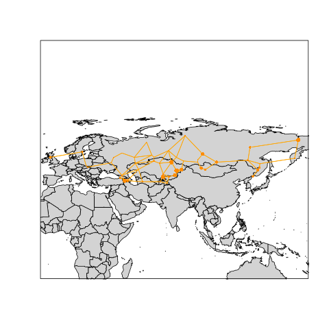

# EvoGeoModules

Analysis of coevolution in spatially replicated host/parasite networks. Data
from [here](http://datadryad.org/resource/doi:10.5061/dryad.jf3tj). Here
is an overview of the data (the spatial graph is the Gabriel graph of the
spatial coordinates).

